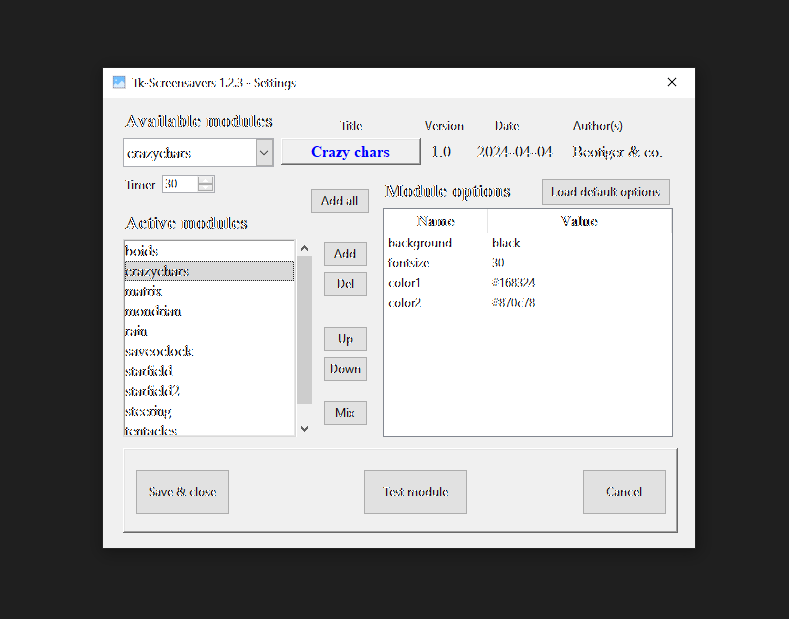
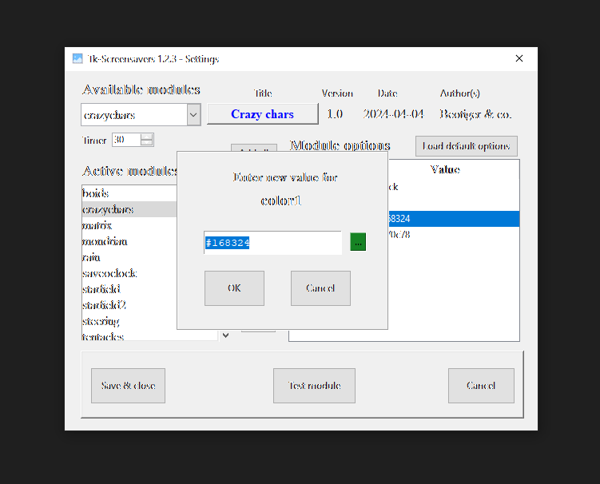

# GUI for settings

There is GUI for settings in `tkscrsavgui.py` module. It is used when main app executes without parameters
or with parameters /c or /C.

While debugging you can launch it through `tkscrsavers.py` or `tkscrsavgui.py` as it is more comfortable for the current situation.

`tkscrsavers.py` uses modules as screensavers from folder `screensavers`. If there is no file `settings.json` or `tkscrsavers` is launched with options `/d` or `/D` it rereads all `.py` files from this folder (except for `__init.py__` and `_skeleton.py`), refresh their app_* settings (except for the `app_options`).

If you changed some module's `app_options` structure (i.e. added new options there or removed/renamed any) you should remove file `settings.json` so that new options structure for that module would be recreated.

Some more information about each screensaver module you may find in each source file `docstrings`.

## Main GUI window.

## Available modules

This combobox let you choose a module from all available modules list. When you select a module all fields under `Title`, `Version`, `Date` and `Authors` will be updated. Clicking on a module title opens its url in a browser.

## Timer

Under this box there is `Timer` spinbox that allows you to edit timer for each module. Only integer values are allowed, minimum is 5 seconds and maximum 3600 seconds (one hour). If you wish you can change this value in `settings.json` file to any amount you wish, but it should be positive integer anyway or you will get an error.

The timer (in seconds) tells when this app should terminate its job and hand over control to next module in quee (see below).

## Active modules

Active module is a listbox where all active modules are shown. When screensaver starts it runs first active module from this list, wait for module `timer` seconds and runs next module in the list. When last module is done screensaver runs first module in the list and so on.

If there is only one module in this list it will work alone as long as user do not presses keys on their keyboard or moves their mouse.

If there is no modules in the list the screensaver will finish its job silently.

Buttons to the right from `Active modules` listbox:

`Add all` - adds all modules that is not there in active modules list.
`Add` - adds current module - that is selected in Available modules combobox - to active modules list. Module will be added above current selected module in listbox or at the end if there is no one.
`Del` - deletes current selected in listbox active module from the list.
`Up`, `Down` - lets you order active modules list.
`Mix` - mix up randomly the whole active modules list for no reason.

## Module options

Treeview `Module options` allows you to edit options for currently selected in combobox or listbox module. All modules have their unique set of options which you can find in [README_savers.md](README_savers.md) file or in source files in `screensavers` folder under `app_options` variable.

When you click twice by mouse or press `Enter` key on any option there then the new dialog window opens to let you edit it. If option is a color type there is a color chooser button right to its value entry.

Options can be `int`, `float`, `bool`, `list` or `tuple` types. If you enter incorrect value for curent option type you will get `Value error` and should enter new value. Also when you edit color option you must enter correct `Tkinter color` value or you will get the same value error. `list` and `tuple` values should be separated by spaces.

**Note.** All color values that you change should abide to `Tkinter` valid color values or **module may not work**. They should be strings in `#RGB` or `#RRGGBB` or `#RRRGGGBBB` format where `R`, `G` and `B` is a HEX value from 0 to F(f).

Or you can also use any locally defined standard color name. Basic color names are: `'white'`, `'black'`, `'red'`,
`'green'`, `'blue'`, `'cyan'`, `'yellow'`, and `'magenta'`. For a full set of such names look at this page: [Tkinter colors](https://www.plus2net.com/python/tkinter-colors.php)

As a rule `Settings GIU` of `Tk Screensavers` won't let you save invalid color value so there is few issues left.

`ESC` or `Enter` keys work as `Cancel` and `OK` buttons respectively in edit option dialog.

**Note**: when you double click on option with `bool` type, i.e. it has `True` or `False` value, it will be changed on the spot without opening any dialogs. Is it a right way to do this? You judge.

Also there is a button `Load default options` over the top right corner of treeview box that lets you reload default options for current module.

## Test module

**Yahoo!** You can test current module with its options set by click big button `Test module`. New window opens where you can see module animations.

As a rule the next set of keys are available in test mode for any module:

`ESC` - close module (quit).
`Space bar` - pause/unpause module animation.
`F11` - toggle full screen mode on/off.

Also any module may allow you its own set of actions by mouse clicking/moving or key presses.

## Close GUI window

You can close main GUI `Tk Screensavers` window several ways.

### Save & close button

This button lets save all currently active modules list with its timers and order and all their options in file `settings.json` which is used by `Tk Screensavers`.

### Cancel button

This button and any other buttons that allow you to close application will discard any changes in active modules list and all modules options that you've done, so `settings.json` file will not be updated.

## Good bye and see you later!

So be it! Thank you for reading this post and paying your attention to the whole project.

Sincerely Yours,
Beotiger & co.
@2024-04-06 23:36
