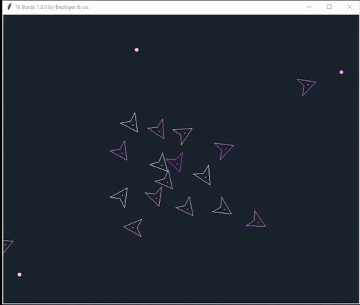
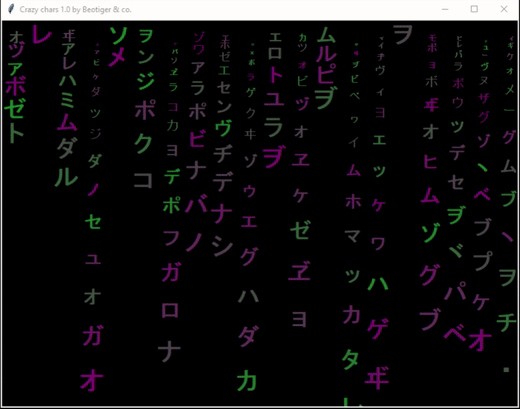
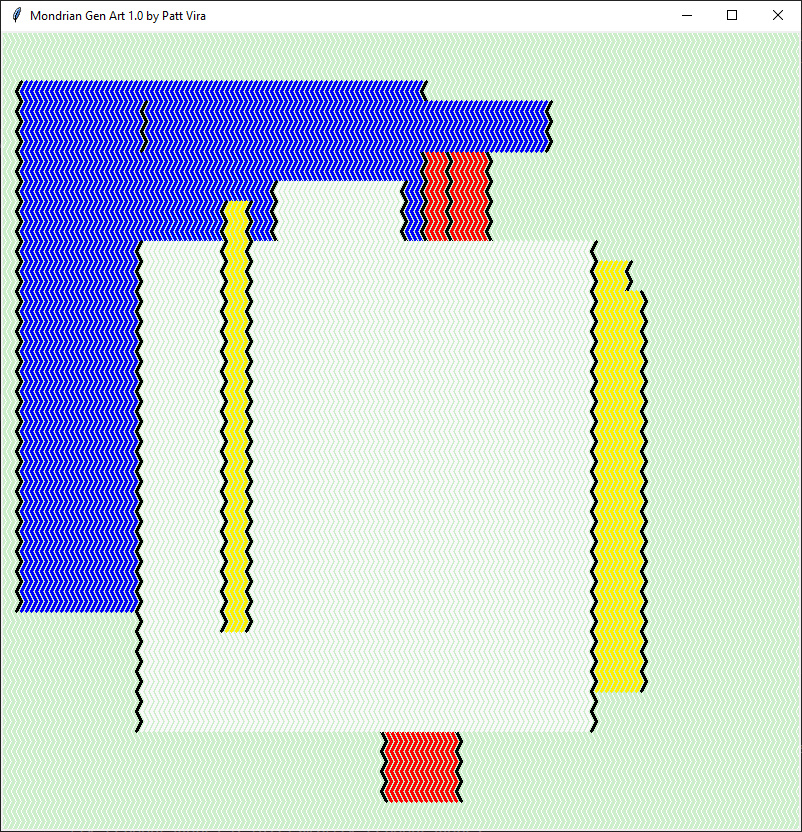
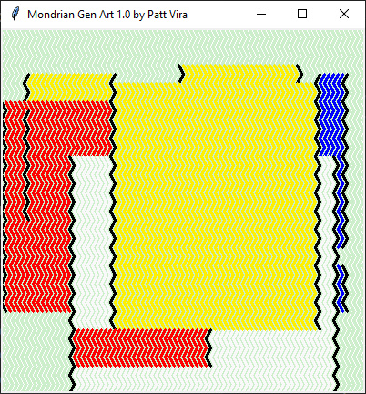
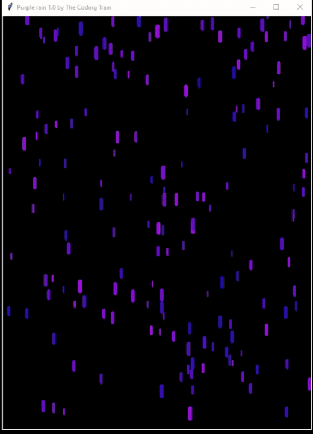
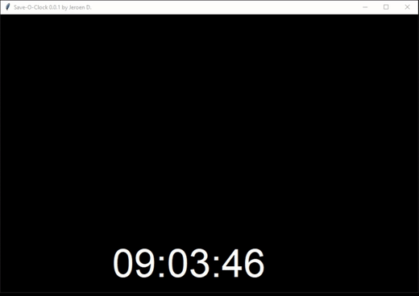
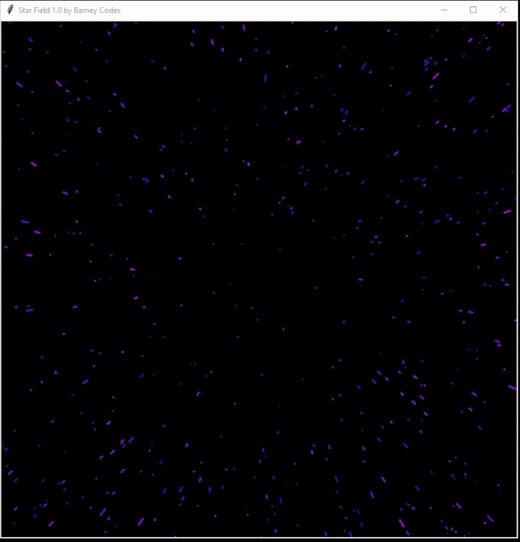
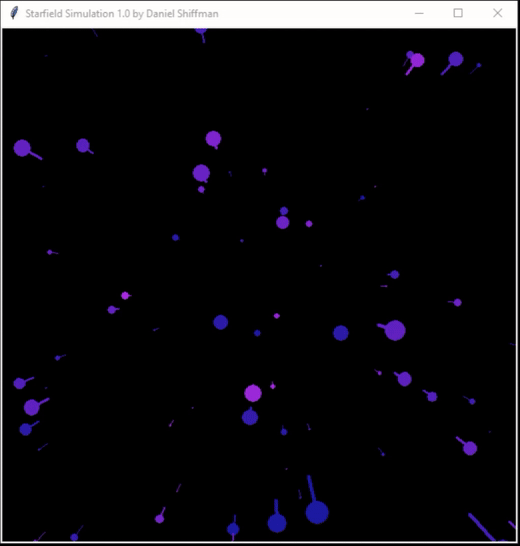
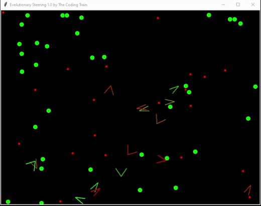
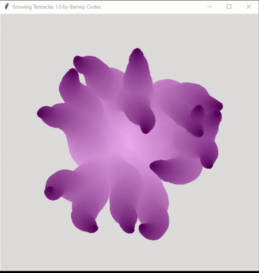

# Modules in folder screensavers

While testing module you can use the following keys:

* `ESC` - close module (quit).
* `Space bar` - pause/unpause module animation.
* `F11` - toggle full screen mode on/off.

Also some modules let you do more actions such as add new object or follow it (`Tk boids` and `Steering` by left/right mouse click respectively) and so on.

More information about each screensaver module you may find in each source file `docstrings`.

## Tk Boids

This is one of Craig Reynolds flocking behavour implementation using `Python` and `Tkinter Canvas`. This code based on [BoidsCanvas](https://github.com/mschristensen/BoidsCanvas) by Mike Christensen which is written in `Javascript` using `HTML5 Canvas`. Some new mechanics were added.

All options you can use:

| Option name | Default value | Description |
|:-----------:|:-------------:|:------------|
| background | '#1a252f' | Background color |
| boidColours | ['#FFF', '#FBF', '#F8F', '#F4F'] | Сolor of boids in list format. You can add as many colors as you want |
| boidRadius | 40 | Size/radius of boids in pixels |
| vid | 'boid' | Boid represantation: 'boid', 'ball', 'any' |
| density | 'low' | Number of boids depending on screen size: 'low', 'medium', 'high' |
| numboids | 0 | Or use this precise number (if 0 density will be used) |
| speed | 2 | Maximum speed of boids |
| interactive | False | Should boids follow mouse cursor position |
| colorize | False | Should boids group each other by color |
| mixedSizes | False | If spawned boids will be mixed sizes |
| bounce | False | If boids should bounce off screen edges |
| visibleRadius | 200 | How far boids will see (in pixels) |
| separationDist | 40 | How far boids may align from each others (in pixels) |
| useChasePoints | True | If we should use new chase mechanic for our boids |
| showChasePoints | True | If we should watch new chase mechanic for our boids |

## Crazy Chars

It is a base module to create crazy char behaviours, bad or good ones. This demo emulates `matrix` screensaver behaviour.

| Option name | Default value | Description |
|:-----------:|:-------------:|:------------|
| background | 'black' | Background color |
| fontsize | 30 | Font size of chars in pixels |
| color1 | '#168324' | Start color for gradient palette |
| color2 | '#870c78' | Stop color for gradient palette |
| speed | 3 | Speed: integer from 1 to 5, 1 - minimum, 5 - maximum

## Matrix Digital Rain

This is not a real matrix. But our world is!

| Option name | Default value | Description |
|:-----------:|:-------------:|:------------|
| background | 'black' | Background color |
| fontsize | 30 | Size of symbols in pixels |
| color0 | '#90EE90' | Used as a lighter color |
| color1 | '#28A028' | Gradient color start |
| color2 | '#28FF28' | Gradient color stop |

## Mondrian Gen Art

Why there is such art here? Because it is so beautiful and gorgeous! Why it is so beautiful and gorgeous? Ask Mondrian about this!

| Option name | Default value | Description |
|:-----------:|:-------------:|:------------|
| background | '#cdeeca' | Background color |
| colors | ['#FFF001', '#FF0101', '#0101FD', '#f9f9f9'] | Used colors
| columns | 5 | Number of arts
| timer | 15 | Timer to redraw art in seconds

## Purple Rain

You should not catch radiation syndrome under this smart purple rain spilled on us by Daniel Shiffman.

| Option name | Default value | Description |
|:-----------:|:-------------:|:------------|
| background | 'black' | Background color |
| drops | 200 | How many drops there is |
| color1 | '#1A1BA2' | Gradient color start |
| color2 | '#AA2BE2' | Gradient color stop |

## Save-O-Clock

Save'o'clock let you never miss five o'clock tea pause.

| Option name | Default value | Description |
|:-----------:|:-------------:|:------------|
| background | 'black' | Background color |
| time_format | '%H:%M:%S' | Date/time format or it can be any string
| font_family | 'JetBrains Mono' | Font family
| font_size | 64 | Font size in pixels
| foreground_color | 'white' | Color of text
|circles | 3 | How many circles should pass before direction changes

## Star Field

So many stars. Why they are going?

| Option name | Default value | Description |
|:-----------:|:-------------:|:------------|
| background | 'black' | Background color |
| colorMode | True | Color or b&w mode for stars |
| color1 | '#1A1BA2' | Gradient color start |
| color2 | '#AA2BE2' | Gradient color stop |
| numstars | 500 | Total count of stars |
| acceleration | 0.4 | Acceleration of each star if not in cycled mode |
| cycled | True | Cycle star accelaration |
| interactive | False | When in interactive mode mouse will speed up/speed down stars |
| starWidth | 3 | Star width in pixels |

## Starfield Simulation

And even more stars. When will they stop moving so fast?

| Option name | Default value | Description |
|:-----------:|:-------------:|:------------|
| background | 'black' | Background color |
| colorMode | True | Color or b&w mode for stars |
| color1 | '#1A1BA2' | Gradient color start |
| color2 | '#AA2BE2' | Gradient color stop |
| speed | 22 | Default star speed |
| stars | 800 | Number of stars on the screen |
| showTails | True | If we should show star tails

## Evolutionary Steering

Unbeliavable life live steering simulation. Why do I ever worry about each of this tiny one?

| Option name | Default value | Description |
|:-----------:|:-------------:|:------------|
| background | 'black' | Background color |
| vehicles | 15 | Number of vehicles |
| vehicleRadius | 15 | Vehicle size |
| vehicleWidth | 2 | Vehicle lines width |
| vehicleAngle | 40 | Vehicle angle |
| shrink | True | Should we shrink a vehicle angle depending on its velocity |
| food | 40 | Maximum number of food |
| poison | 20 | Maximum number of poison |
| foodRadius | 7 | Size of food |
| poisonRadius| 4 | Size of poison |
| foodColor | '#00FF00' | Color of food |
| poisonColor | '#FF0000' | Color of poison |
| debug | False | If we want more info about every vehicle... Answer: No ;) |

## Growing Tentacles

They will catch you up someday and make you learn `Python` better :)

| Option name | Default value | Description |
|:-----------:|:-------------:|:------------|
| background | '#DCDCDC' | Background color |
| speed' | 0.3 | Default tentacles speed |
| startRad | 30 | Starting radius of tentacles |
| dynamicRad | True | Or use dynamic radius which depends on window height |
| num | 15 | Starting number of tentacles |
| startColor | '#500050' | Start color for tentacles gradient palette
| endColor | '#FFC8FF' | End color for tentacles gradient palette
| timer | 15 | Timer in seconds when redraw tentacles (0 to disable) |
